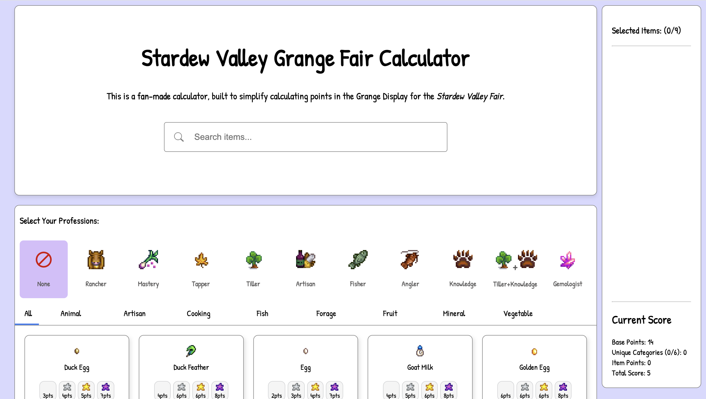

# Stardew Fair Calculator

A **Stardew Valley Fair calculator** for players who want to **optimise their Grange Display** and **maximise star tokens**.

Check it out live: [stardew-fair-calculator.vercel.app](https://stardew-fair-calculator.vercel.app)

---

## Features

- **Calculate your Grange Display score** based on the items you own.
- **Search items** using the search bar if you know what you have.
- **Select items manually** via clickable tables if you’re unsure.
- **Professions**: Includes items for specific professions.
- **Cart improvements**: Scrollable cart, no items with 0 points.
- **Images for all items**: Includes Aged/Dried items.
- **Unique category scoring fixes**: Calculations based on from the official website (https://stardewvalleywiki.com/Stardew_Valley_Fair) .

**Planned / To-Do Features:**

- Sort items ascending/descending by points.
- Mobile responsiveness.

---

## Tech Stack

- HTML
- CSS
- JS
- Vue

---

## How to Use

1. Open the live app or run locally.
2. **Search for items** you have or click items on the tables to add them to your cart.
3. See your **total score** and optimise your display accordingly.

---

## Screenshots / Demo

18/05/26 - Added mobile responsiveness! 
I realised that most people have phones and would rather view on phone than pc so I added it in. 

https://github.com/user-attachments/assets/533471e2-bb72-4943-bcda-a5e753bb3467

---

## Project Status / Fixes

✅ Fixed:

- Minerals category scoring
- Added images to items
- Gap issues in artisan goods (image + name)
- Alerts for professions with no items
- Unique category calculation
- Professions in cart
- Removed items with 0 points
- NEW: Mobile responsiveness!
- Added description for newbies

⚠️ To-Do:

- Sort ascending/descending by points
- ~~Mobile responsiveness~~
- First Place/Second Place results alert
- ~~Added description for newbies~~
- Make error alerts pretty -> its just an alert() rn lol

---

## Next Project Ideas

- **Preserves Jar Profit Calculator**:
  - Calculate profitability of crops for preserves jars.
  - Include seasonal availability.
  - Factor multi-harvest crops (e.g., corn vs cauliflower).
  - Advanced filtering: seasons, coops/barn ownership, etc.

---

## License

All images and game content rights belong to **Stardew Valley / ConcernedApe**. This project is for educational and personal use.
